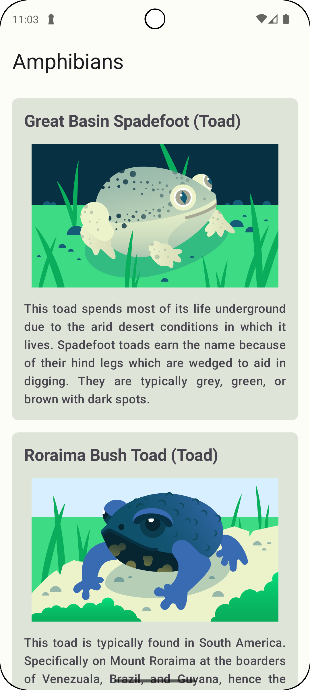

# Amphibians App

The **Amphibians** app is built using **Jetpack Compose** to display a list of amphibians

## Features
- Fetch book data from [Google App Engine (Appspot)](https://android-kotlin-fun-mars-server.appspot.com/amphibians?hl=vi).
- Display book list in a column layout (LazyColumn).
- Built with **Jetpack Compose** and **Material 3**.
- Uses **Coil** for image loading.

## Tech Stack
- **Kotlin**
- **Jetpack Compose**
- **Material 3**
- **Coil**
- **Retrofit** for API calls

## Screenshots


## Installation & Run
1. Clone the repository:
   ```bash
   git clone https://github.com/username/Amphibians.git
